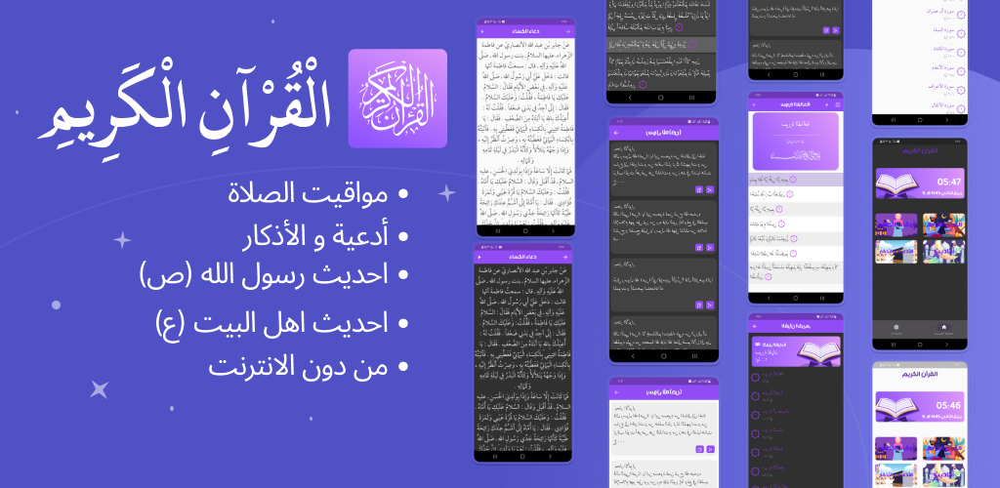

 

  

<h3 align="center">قرآني</h3>

  

    حمل التطبيق قرآني من سوق بلي
     
    <a href="https://play.google.com/store/apps/details?id=com.quran.dev"><strong>Download app »</strong></a>
     
     
    
  

  

<b>تطبيق القران الكريم</b>

##:rocket: youtube Tutorial
### اقرأ واستمع إلى القرآن الكريم واستمع إليه واستكشفه من خلال تطبيق قرآني المحسن  والمليء بالميزات والذي يأتي مع تلاوات قرآنية كاملة من أكثر من 8 قارئًا ، تصميم مذهل لواجهة المستخدم وأفضل مجموعة من الميزات!

- خيار التمرير التلقائي الذي يسمح لك بقراءة القرآن دون الحاجة إلى تمرير المحتوى يدويًا لأسفل
- استمع إلى التلاوة الصوتية حتى عندما يكون التطبيق في الخلفية أو جهازك مقفلاً
- استمع إلى التلاوة الصوتية بصوت اكثر من قارئ
- أوقات الصلاة في جميع بلدان العالم
- إشعارات أذكار مخصصه
- احديث النبي محمد (ص) وال البيت (ع)
- وضع الفاتح و الداكن

------------------------------

## Snapshots

| 1 | 2                       |
|------|-------------------------------------------|
||  |

| 3                                      | 4                         |
|---------------------------------------------|----------------------------------------------|
|  |  |

| 5                                     | 6                             |
|----------------------------------------------|----------------------------------------------|
|  |  |

